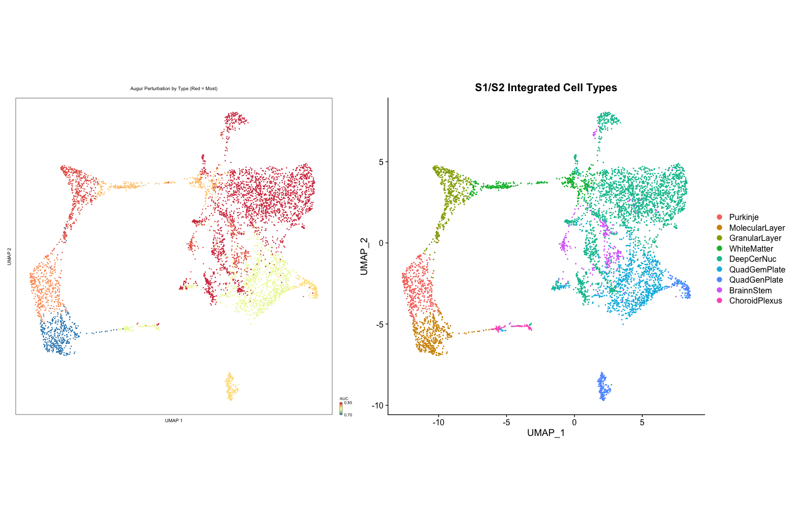

## Using Augur with Spatial scRNA-seq 

Spatial single cell RNA-seq data are essentially regular single-cell RNA-seq data that have spatial coordinates associated through localization on a special capture slide. I had previously used so-called "perturbation" analysis successfully with 10X single-cell data and I wanted to apply the technique to spatial single cell to understand how a treatment affects the spatially-resolved clusters.

Here, I want to briefly describe the steps I went through to perform 'augur' perturbation analysis of 10X Visium Spatial single cell RNA-seq data.   augur works as follows:  

Augur is an R package to prioritize cell types involved in the response to an experimental perturbation within high-dimensional single-cell data. The intuition underlying Augur is that cells undergoing a profound response to a given experimental stimulus become more separable, in the space of molecular measurements, than cells that remain unaffected by the stimulus. Augur quantifies this separability by asking how readily the experimental sample labels associated with each cell (e.g., treatment vs. control) can be predicted from molecular measurements alone. This is achieved by training a machine-learning model specific to each cell type, to predict the experimental condition from which each individual cell originated. The accuracy of each cell type-specific classifier is evaluated in cross-validation, providing a quantitative basis for cell type prioritization.

I followed both the Seurat 10X Visium vignette as well as a dataset integration protocol to combine two treatment (a gene knockout, in this case) and control samples (S1 and S2).   Normalization was performed by "SCTransform" as recommended for spatial RNA-seq data prior to integration.   PCA,  K-nearest neighbors, clustering, and uMAP were calculated as described in the Seurat vignette using default values.    Cell types were assigned in collaboration with the experimentalists.  

With the integrated, clustered and, assigned dataset in hand, I was ready to enter the "augur" workflow as described in the paper, with some minor tweaks. First, because this is spatial and not regular scRNA-seq, there is no "RNA" default assay to set after integration. I chose to set "SCT" as the assay instead, because this represents the normalized and scaled dataset which is what you want for input to an ML model.

## Import the notebooks into your site

```r
library(Augur)
DefaultAssay(s1s2.int) <- "SCT"
augur <- Augur::calculate_auc(s1s2.int, label_col = "orig.ident", cell_type_col = "cell_type", 
                              n_threads = 6, 
                              rf_params = list(trees = 15, mtry = 2, min_n = NULL, importance = "accuracy"),
                              n_subsamples = 25,
                              )
```

Above, you can see the actual call to augur "calculate_auc" method. I found that by specifying 'rf_params' and reducing the number of trees, I got better separation between cell types in the AUC readout. The calculation takes about 20 minutes to run on a 2018 MacBook Pro 13 inch laptop.

When the algorithm completes, you can visualize your results. Using the vignette for regular scRNA-seq you can do this:

```r
library(patchwork)
p1 <- plot_umap(augur, s1s2.int, mode = "default", palette = "Spectral")
p1 <- p1 + geom_point(size=0.1) + ggtitle("Augur Perturbation by Type (Red = Most)")
p2 <- DimPlot(s1s2.int, reduction = "umap", group.by = "cell_type") + ggtitle("S1/S2 Integrated Cell Types")
p1 + p2 
```

    

    
